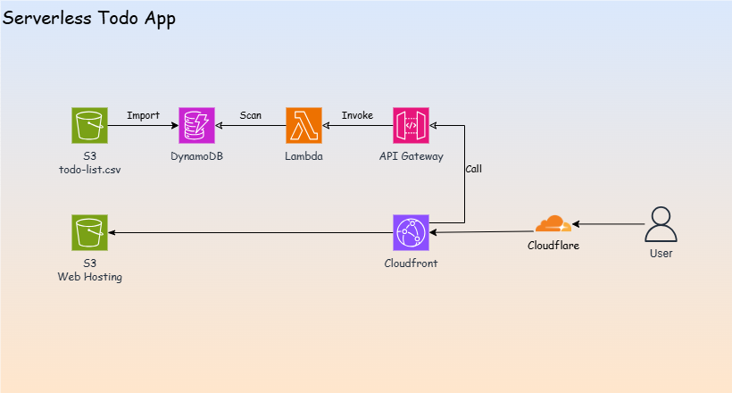
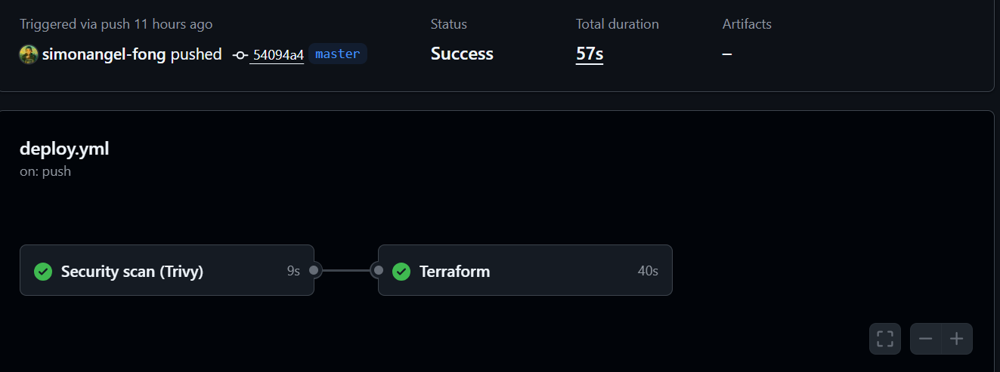
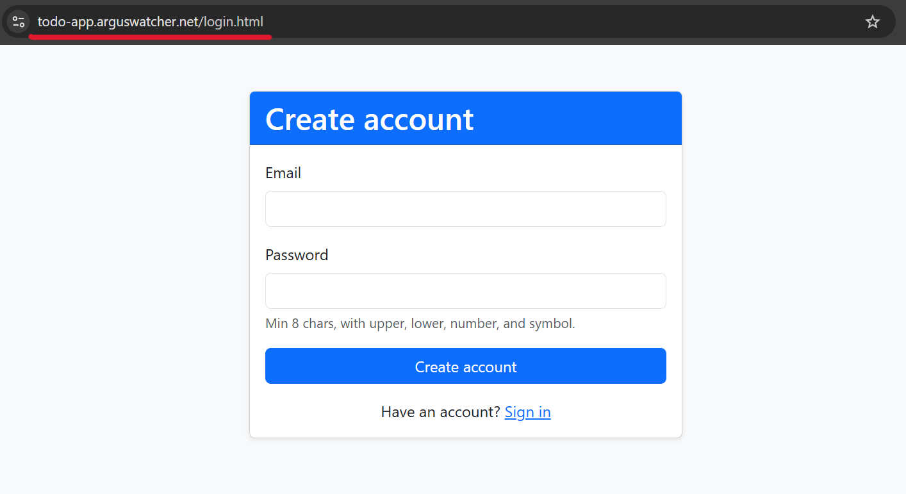
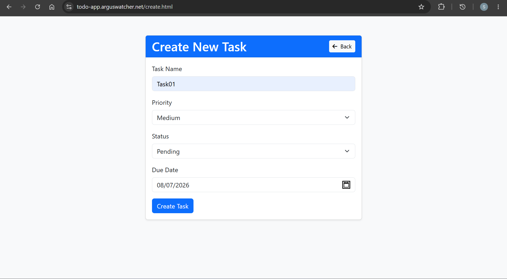
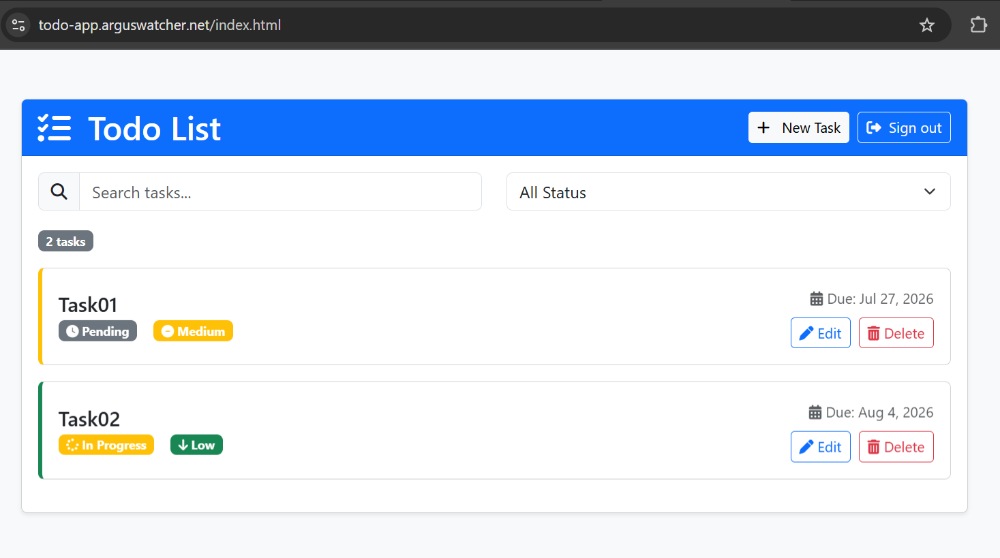
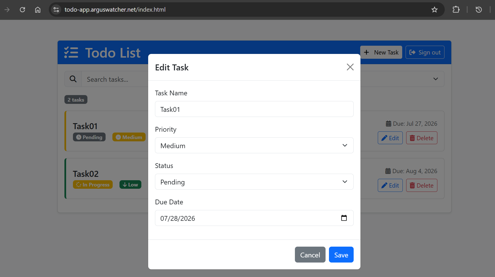
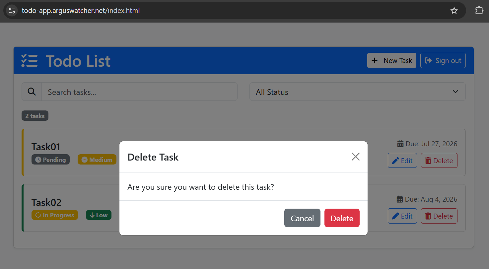

# Serverless Todo App (AWS)

A serverless, multi-user todo app on AWS.

## Specification

- Tech Stack

| Layer      | Tech                                           |
| ---------- | ---------------------------------------------- |
| Frontend   | Static HTML/JS on `S3` + `CloudFront`          |
| API        | `API Gateway` (REST) → `Lambda` (Python)       |
| Auth       | `Cognito` user pool; ID token on every request |
| Data       | `DynamoDB`                                     |
| DNS        | `Cloudflare` CNAME → `CloudFront`              |
| IaC        | `Terraform` (remote `S3` state)                |
| CI/CD      | `GitHub Actions` OIDC, `Trivy` scan            |
| Monitoring | `CloudWatch` alarms + dashboard                |



- File Layout

```
.claude/  Claude Code skills
.github/  deploy.yml, destroy.yml, dependabot.yml
docs/     API contract + project plan
infra/    Terraform (one file per resource group) + dev.tfvars
lambda/   src/ (handler→service→repository) + tests/
web/      static frontend (config.js rendered by Terraform)
```

---

## Development & Deployment

- Local Development

```sh
# Test the Lambda locally
cd lambda && python -m pytest tests/

# Initialize with the remote backend
terraform -chdir=infra init -backend-config=backend.hcl
# Apply using the local dev.tfvars file
terraform apply -var-file=dev.tfvars
```

---

- Production Deployment
  - CI/CD pipeline: managed by `GitHub Actions`
  - Shift-left security: automated `Trivy` scans in the pipeline
  - Authentication security: uses `OIDC` with `AWS`
  - Environment isolation: provided through the `GitHub Actions` environments feature

- `GitHub Actions` in Action
  

---

## Application Demo

- Sign up: todo-app.arguswatcher.net
  

- Create a todo item
  

- List todo items
  

- Update a todo item
  

- Delete a todo item
  

---

## AI Tool Reflection - `Claude Code`

- This project uses the AI tool `Claude Code`.
  - Workflow:
    - Brainstorm the design for a new version.
    - Document the refactoring design in [/docs/00-PLAN.md](./docs/00-PLAN.md).
    - Create skills with clear instructions for `Terraform` and `GitHub Actions` workflows.
    - Iterate through each refactoring cycle with `Claude Code`.
- Lessons:
  - A skill with clear instructions improves productivity more than a role-based subagent.
  - Keeping a human in the loop is important. Depending on the context, `Claude Code` may suggest an overengineered design.
    - For example, `Claude Code` suggested using both **terraform apply** and the **AWS CLI** to deploy the web app. In this case, Terraform alone is sufficient.
  - General skills follow best practices, while custom rules require manual editing.
